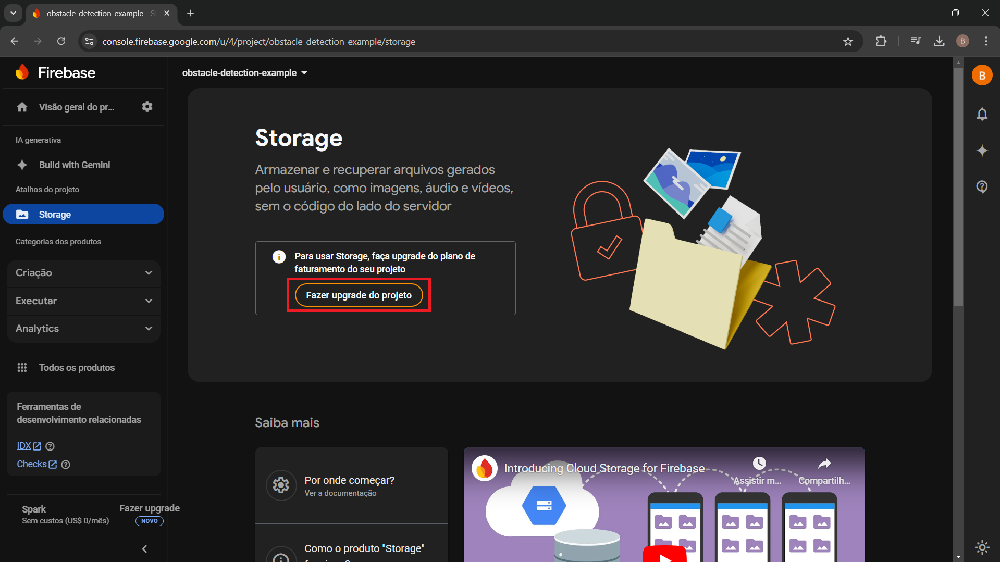

# Configuração do Firebase e Credenciais

- Acesse o **Firebase Console** com sua conta: https://console.firebase.google.com/

- Inicie um novo projeto:

  

- Crie o projeto com qualquer nome, aceite os termos do Firebase e clique em **Continuar**:

  

- Ativar o **Google Analytics** é opcional. Clique em **Continuar**:

  

- Caso tenha ativado o **Google Analytics**, configure-o e clique em **Criar Projeto**

  

- O projeto foi criado. Clique em **Continuar**:

  

- Vá para **Configurações do Projeto**:

  

- Em seguida, acesse a aba **Contas de serviço**, selecione a opção **Python** e clique em **Gerar nova chave privada**.

  

- Após o passo anterior, será baixado um arquivo **JSON**. Esse arquivo deve ser renomeado para **credencial.json** e copiado para a pasta **credenciais**, localizada na raiz do projeto, no diretório: *obstacle-detection\credenciais*.

  

- Volte ao menu principal do Firebase, acesse o menu lateral **Criação** e selecione **Storage**.

  

- Nesse momento, para utilizar o **Storage**, será exigido um upgrade da conta para o plano **Blaze**, uma medida adotada pelo Firebase desde 30/10/2024. Mais detalhes podem ser encontrados nos seguintes portais:  
https://firebase.google.com/docs/storage/web/start?hl=pt#before-you-begin  
https://firebase.google.com/pricing?hl=pt-br  
Porém, ainda é possível utilizar o **Storage** gratuitamente, desde que não ultrapasse o limite de uso. Então, clique em **Fazer upgrade do projeto** e, em seguida, em **Criar uma conta do Cloud Billing**. Será necessário informar os dados de um cartão de crédito para possíveis cobranças adicionais:

  

  

- Após concluir o processo anterior, é possível prosseguir com a criação do **Storage**. Clique em **Começar**:

  

- Na configuração do **Bucket**, mantenha todas as opções padrão e clique em **Continuar**:

  

- Na configuração de **Regras de segurança**, selecione a opção **Iniciar no modo de teste** e clique em **Criar**:

  

- Após a criação do **Storage**, acesse a aba **Regras**, altere o código para permitir acesso até uma data mais posterior e clique em **Publicar**:

  

- Volte para a aba **Arquivos** e crie duas pastas com os nomes **imagens** e **models**:

  

- Ficando da seguinte forma:

  

- Para finalizar, ainda no **Storage**, clique em **Copiar caminho do arquivo**:

  

- Dentro do projeto, no arquivo **FirebaseHelper.py**, cole o caminho copiado no valor de **storageBucket** e remova a parte inicial do caminho, **gs://**, para que fique da seguinte forma:

  

  

