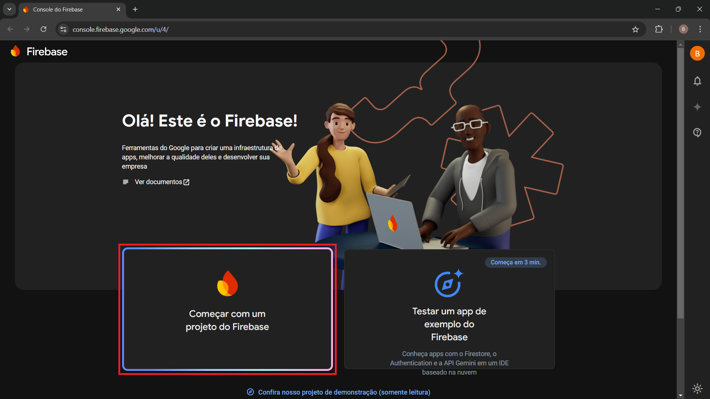

# Configuração do Firebase e Credenciais

- Acesse o **Firebase Console** com sua conta: https://console.firebase.google.com/

- Inicie um novo projeto:

  

- Crie o projeto com qualquer nome:

  

